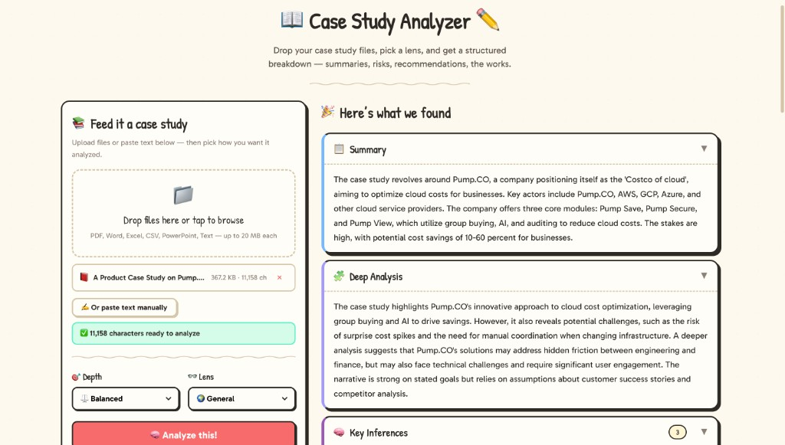

# Case Study Analyzer

**Turn any case study into structured, actionable intelligence in seconds.**

Upload a PDF, Word doc, spreadsheet, or just paste text — pick an analytical lens (Product Manager, Consultant, AI/ML Specialist, Economist, and more) — and get a full breakdown: summary, deep analysis, key inferences, statistical evidence, anomalies, risks, recommendations, and follow-up questions. Powered by Groq's Llama 4 or Google Gemini, with a playful hand-drawn UI that feels refreshingly human.

[](https://case-agent-5oxkxwc7j-warlord437s-projects.vercel.app/)
[](https://nextjs.org)
[](https://typescriptlang.org)
[](https://vercel.com)

---



---

## The Problem

Case studies are dense. Reading a 10-page report and pulling out the key inferences, risks, anomalies, and recommendations takes time — time that could be spent acting on those insights. Existing "summarizer" tools give you a paragraph and call it done. That's not analysis, that's compression.

## What This Does Differently

Case Study Analyzer runs a **two-pass AI pipeline** that goes beyond summarization:

1. **Pass 1 — Extraction:** The AI reads the full text and pulls out entities, themes, facts, quantitative data, problems, opportunities, unsupported claims, and notably absent information.
2. **Pass 2 — Analysis:** Using the structured extraction, the AI writes a deep analytical report with inferences, statistical evidence evaluation, anomaly detection, and actionable recommendations — all through the lens you choose.

The result isn't a summary. It's a structured analytical brief you can act on.

## Features

- **8 Analytical Lenses** — General, Product Manager, Business Analyst, Consulting, UX Researcher, Software Engineer, AI/ML Specialist, Global Economist. Each fundamentally changes the analytical perspective.
- **3 Depth Levels** — Quick glance, Balanced, or Deep dive. Controls how exhaustive the output is.
- **Multi-format Upload** — PDF, Word (.docx), Excel (.xlsx/.csv), PowerPoint (.pptx), plain text. Drag-and-drop or click to browse.
- **10 Output Sections** — Summary, Deep Analysis, Key Inferences, Key Points, Statistical Evidence (with context), Anomalies (with severity), Focus Areas, Risks, Recommendations, Follow-up Questions.
- **Responsive Design** — Works on phones, tablets, and desktops. Mobile-first layout with touch-friendly controls.
- **Provider Agnostic** — Ships with Groq (Llama 4 Scout), Google Gemini, and a stub provider for offline development. Add your own in minutes.
- **Security Hardened** — CSP headers, HSTS, rate limit handling, input sanitization, no API keys in URLs, error messages that don't leak internals.

## Quick Start

```bash
git clone https://github.com/YOUR_USERNAME/case-agent.git
cd case-agent
npm install
```

**With a real LLM (recommended):**

```bash
# Get a free Groq key at https://console.groq.com/keys
echo "GROQ_API_KEY=your_key_here" > .env.local
npm run dev
```

**Without any API key (stub mode):**

```bash
npm run dev
```

Open [http://localhost:3000](http://localhost:3000) and upload a case study.

## How It Works

```
User uploads file/text
        │
        ▼
  POST /api/upload         ← Extracts text from PDF/DOCX/XLSX/etc.
        │
        ▼
  POST /api/analyze        ← Validates, normalizes, calls LLM pipeline
        │
        ├── Pass 1: Extract    → Entities, themes, facts, numbers,
        │                        problems, opportunities, gaps
        │
        └── Pass 2: Write      → Summary, analysis, inferences,
                                  stats, anomalies, risks, recs
        │
        ▼
  Structured JSON response  → Rendered in collapsible card UI
```

## Architecture

```
app/                           # Next.js App Router
├── api/analyze/route.ts       # Analysis endpoint
├── api/upload/route.ts        # File upload endpoint
├── page.tsx                   # Main page
├── layout.tsx                 # Root layout with viewport config
├── error.tsx                  # Error boundary
└── globals.css                # Hand-drawn cartoon styling

frontend/                      # Client code
├── components/
│   ├── InputPanel.tsx         # Upload, paste, depth/lens controls
│   ├── OutputPanel.tsx        # 10-section analysis display
│   └── FileUploadZone.tsx     # Drag-and-drop file handler
└── types/
    └── analysis.ts            # Shared TypeScript types

backend/                       # Server code
├── lib/
│   ├── parse-file.ts          # PDF/DOCX/XLSX text extraction
│   ├── sanitize.ts            # Input normalization
│   ├── limits.ts              # Input size constraints
│   └── hash.ts                # SHA-256 (for future caching)
└── llm/
    ├── pipeline.ts            # 2-pass extract → write pipeline
    ├── prompts.ts             # Lens-aware prompt engineering
    ├── schema.ts              # Result shape factory
    └── providers/
        ├── groq.ts            # Groq (Llama 4 Scout) — default
        ├── gemini.ts          # Google Gemini 2.0 Flash
        └── stub.ts            # Offline stub for development
```

## LLM Providers

| Provider | Model | Speed | Free Tier | Setup |
|----------|-------|-------|-----------|-------|
| **Groq** (default) | Llama 4 Scout 17B | ~3-6s | 14,400 req/day | [console.groq.com/keys](https://console.groq.com/keys) |
| **Gemini** | Gemini 2.0 Flash | ~5-10s | 1,500 req/day | [aistudio.google.com/apikey](https://aistudio.google.com/apikey) |
| **Stub** | N/A | instant | unlimited | No key needed |

The app checks for `GROQ_API_KEY` first, then `GEMINI_API_KEY`, then falls back to the stub.

### Adding a New Provider

Create a file in `backend/llm/providers/` implementing the `LLMProvider` interface:

```typescript
import type { LLMProvider } from "./stub";

export class MyProvider implements LLMProvider {
  readonly name = "my-provider";
  readonly model = "my-model";

  async generateJson(prompt: string): Promise<string> {
    // Call your API, return JSON string
  }
}
```

Then add it to `resolveProvider()` in `backend/llm/pipeline.ts`.

## Deployment on Vercel

1. Push to GitHub
2. Import the repo at [vercel.com/new](https://vercel.com/new)
3. Add environment variable: `GROQ_API_KEY` (or `GEMINI_API_KEY`)
4. Deploy

The app is configured for Vercel out of the box — `serverExternalPackages` for Node-dependent libraries, security headers, and proper viewport handling are all set.

## Security

- **Content-Security-Policy**, **HSTS**, **X-Frame-Options DENY**, **X-Content-Type-Options nosniff** — all enforced via `next.config.ts`
- API keys passed via headers, never in URLs
- Error responses never leak server internals
- File uploads limited to 10 files, 20 MB each
- Input text validated and normalized server-side
- React Error Boundary for graceful crash recovery
- `.env.local` gitignored, `.env.example` uses placeholder values

## Future Roadmap

- **RAG / Vector DB** — Add a retrieval step before extraction for domain-specific knowledge
- **Caching** — Cache results by input hash using `backend/lib/hash.ts`
- **Streaming** — Server-Sent Events for real-time analysis output
- **Comparison Mode** — Analyze two case studies side-by-side
- **Export** — Download analysis as PDF or Markdown
- **Auth** — User accounts with analysis history

## Tech Stack

- **Framework:** Next.js 16 (App Router, Turbopack)
- **Language:** TypeScript 5
- **LLM:** Groq (Llama 4 Scout), Google Gemini 2.0 Flash
- **File Parsing:** unpdf, mammoth, xlsx
- **Styling:** Custom CSS (hand-drawn cartoon aesthetic)
- **Hosting:** Vercel
- **Fonts:** Gabarito, Patrick Hand

## License

MIT
